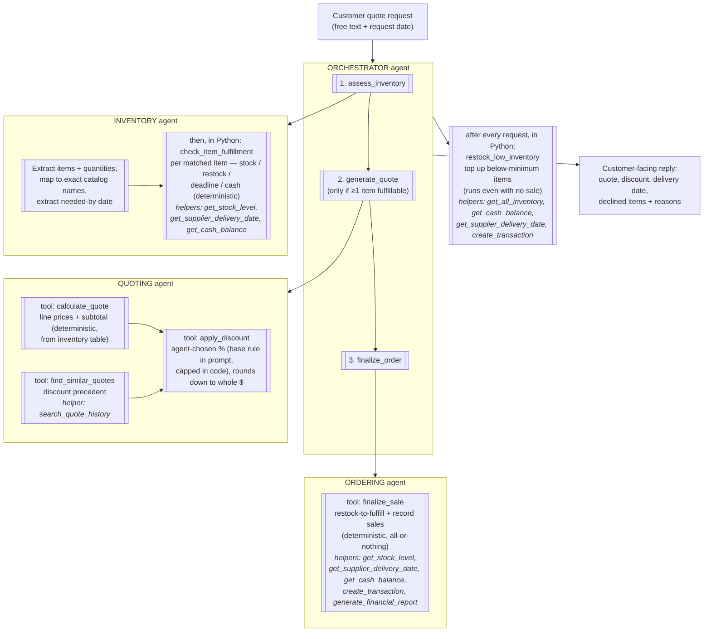

# Munder Difflin — Multi-Agent Workflow Diagram

**Tool → starter-helper map:** `check_item_fulfillment` and `finalize_sale`
build on `get_stock_level`, `get_supplier_delivery_date`, `get_cash_balance`
and `create_transaction` (finalize also reports via
`generate_financial_report`); `find_similar_quotes` wraps
`search_quote_history`; `restock_low_inventory` builds on
`get_all_inventory`, `get_cash_balance`, `get_supplier_delivery_date` and
`create_transaction`. All seven provided helper functions are used.

**Data flow note:** structured results (assessment, quote) pass between steps
through a Python-side context dict; the orchestrator LLM only sequences the
calls and writes the final reply. Inter-agent messages are JSON text.
