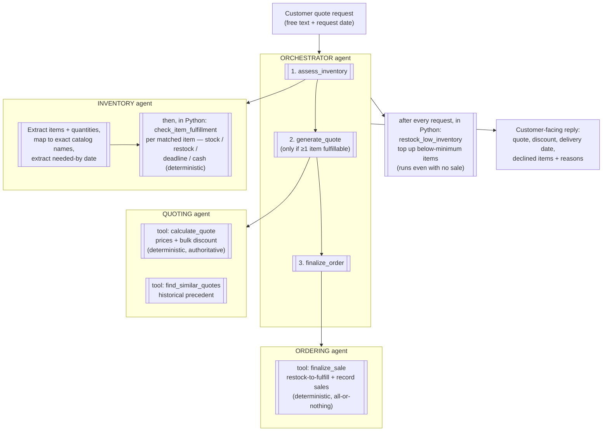

# Munder Difflin — Multi-Agent Workflow Diagram

**Data flow note:** structured results (assessment, quote) pass between steps
through a Python-side context dict; the orchestrator LLM only sequences the
calls and writes the final reply. Inter-agent messages are JSON text.
